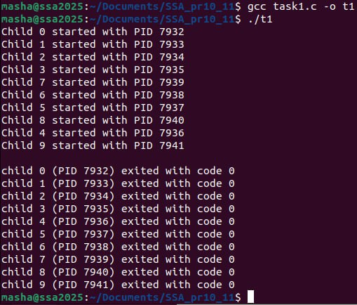

## Задача 1

### Текст завдання
Напишіть програму, яка створює 10 дочірніх процесів, зберігає їхні PID у масиві та чекає завершення кожного через wait().
### *Реазілація*

За допомогою системного виклику fork() створюємо дочірні процеси, PID записуємо в масив, щоб потім відзвітувати по завуршенню кожного із них. Між створенням дочірніх процесів та звітуванням залишаємо паузу 2 секунди, щоб чітко відслідкувати завершення кожного процесу за PID
_______
